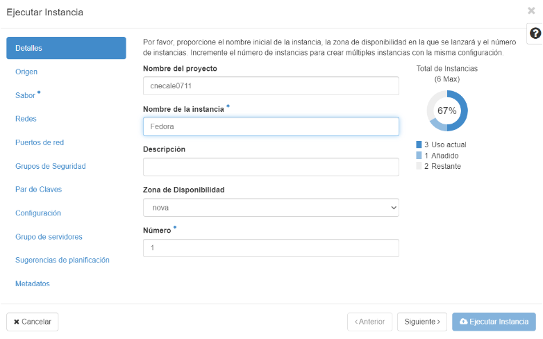
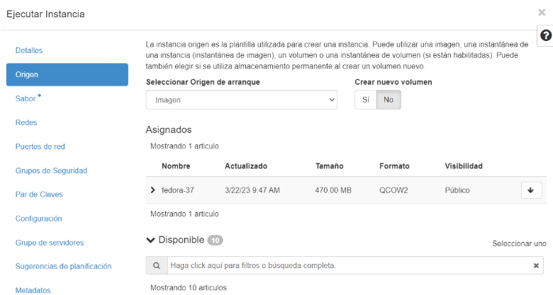
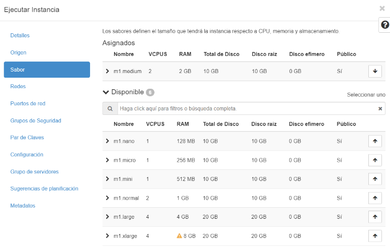
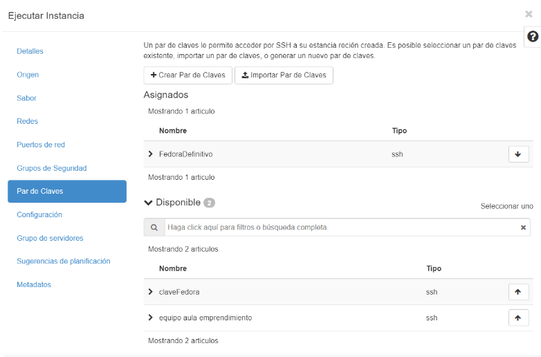
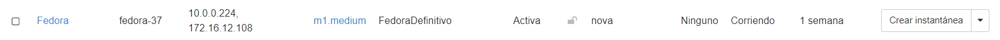
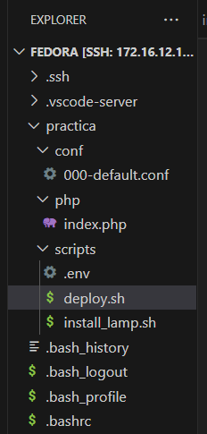
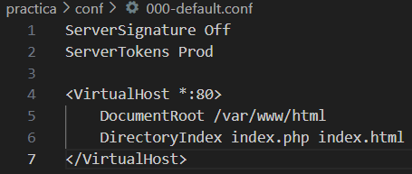
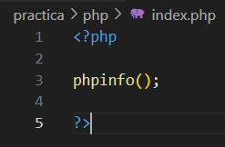
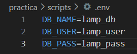
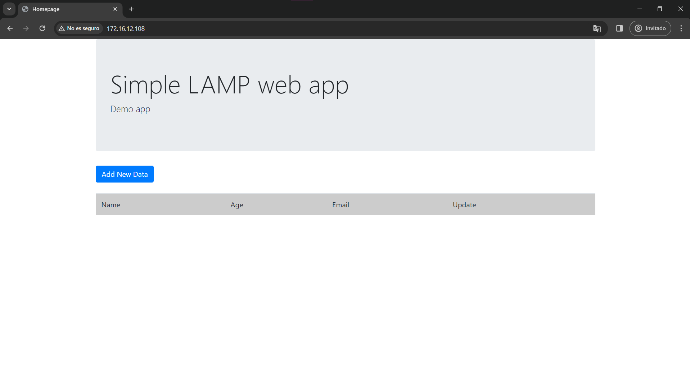

# Práctica Fedora 1.3
## Crear instancia Fedora.

Primero de todo vamos a crear una instancia en OpenStack de Fedora.

La llamamos Fedora mismo.

En origen tenemos que seleccionar que es imagen, y darle a que **NO** vamos a crear un nuevo volumen.

Además le vamos a asignar fedora-37.

En sabor vamos a ponerlo como queramos cada uno, en mi caso usé 2GB de RAM.

Por último creamos una clave, en mi caso hice una llamda FedoraDefinitivo porque probé varias en varias instancias y me salieron mal, pero esa fue la definitiva y funcionó!

Y tenemos creada nuestra instancia de Fedora, funcionando correctamente.

## Crear nuevo host en extensión de SSH de VisualStudio.

Vamos a crear el directorio conf, php y scripts.

Creamos una carpeta llamada conf, en ella pondremos el archivo 000-default.conf, en dicho archivo, lo que hace es establecerte un directorio por defecto donde buscar los archivos que se mostrarán.

Index.php es simplemente la página que se mostrará cuando accedes desde el ip de la máquina de Fedora.

.env almacena variables, donde hemos guardado el nombre, usuario y contraseña.

Este archivo se crea para poder almacenar lo dicho anteriormente y si por algún caso queremos cambiar el nombre o la contraseña, simplemente nos metemos en este archivo y lo cambiamos, de esta manera no tendremos que ir archivo por archivo cambiando todo.

## Deploy y install_lamp

Estos dos archivos con extensión .sh ya viene explicados con comentarios en el script.

Para hacer funcionar dichos archivos tenemos que lanzar unos comandos en en la terminal bash.

Primero hay que darle permisos de ejecución a los archivos con los comandos:

**chmod u + x ./deploy.sh**

**chmod u + x ./install_lamp.sh**

Segudno, nos metemos con cd hasta la carpeta de scripts, y ya ahí ejecutamos los siguientes comandos: 

**sudo ./deploy.sh**

**sudo ./install_lamp.sh**

## Resultado Final

Si todo funciona correctamente, nos vamos a Google y escribimos arriba la dirección ip de nuestra instancia Fedora.

Y nos debería de salir esto:

